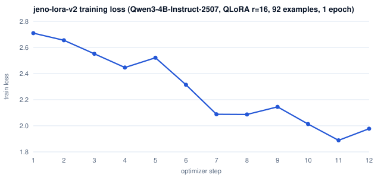

# Fine-tuning evidence

Raw records exported from the production system (Supabase run tables, the
Modal model volume and R2), plus summaries generated from them. Nothing here
was edited by hand except the summaries and the model card.

## 1. The adapter weights

[`weights/jeno-lora-v2/`](weights/jeno-lora-v2/) is the trained LoRA adapter
served as `jeno-lora`: `adapter_model.safetensors` (132 MB, stored with Git LFS),
`adapter_config.json`, the chat template and a [model card](weights/jeno-lora-v2/README.md).

## 2. Training run (v2, active)

| | |
|---|---|
| Run id | `b124a337-9c0a-43d6-943c-6c77557d1941` (Modal L4, 21 Sep 2026) |
| Data | 92 train examples, dataset fingerprint `69f0b4147fd8` |
| Config | QLoRA, r = 16, alpha = 16, 1 epoch, 12 steps, learning rate 1e-4 |
| Loss | **2.71 → 1.98** (step 1 → step 12; lowest 1.89 at step 11; epoch mean 2.28) |

Files: [`loss_curve.csv`](training/v2/loss_curve.csv) (per-step loss, learning rate, gradient norm, GPU memory),
[`train_events.json`](training/v2/train_events.json) (the live telemetry the web app plots),
[`train_run.json`](training/v2/train_run.json), [`adapter_config.json`](training/v2/adapter_config.json),
[`jeno_train_metrics.json`](training/v2/jeno_train_metrics.json).

## 3. Evaluation: base vs fine-tuned on 13 held-out briefs

Both models got the same system prompt and the same 13 briefs, none of which
were seen in training. Each output was scored by the same deterministic quality
gate the API uses. A separate LLM judge compared each pair blind, with the
order randomised.

| | Base | v1 adapter | **v2 adapter (active)** |
|---|---:|---:|---:|
| Quality-gate pass rate | 69.2% (9/13) | 15.4% (2/13) | **76.9% (10/13)** |
| SEO keyword coverage | 95.8% | 52.7% | 92.1% |
| Mean words | 705 | 314 | 744 |
| Mean H2 sections | 4.4 | 0.7 | 4.9 |
| Blind judge (fine-tuned vs base) | — | 0 wins / 13 losses | 3 wins / 2 losses* |

\* Only 5 of the 13 judge verdicts could be parsed in the v2 run.

Base-model numbers are from the v2 run; the v1 run's base scored 76.9% on the
same briefs, so the base itself varies between runs.

- [`eval/v2/per_brief.md`](eval/v2/per_brief.md): scores for every brief.
- [`eval/v2/samples.md`](eval/v2/samples.md): two briefs side by side, unedited.
- `eval/*/results.json`: every prompt and full output for both models.

## What this shows, honestly

- **v1 failed and v2 fixed it.** v1 trained for 3 epochs at learning rate 2e-4
  on 146 examples, including articles with no H2 structure. It learned to write
  short, unstructured pieces and lost to the base model on every brief. v2
  filtered the data (54 examples removed for bad titles, bad meta descriptions
  or fewer than 3 sections), trained 1 epoch at half the learning rate, and
  recovered.
- **v2 follows the house format more reliably than the base model.** It
  scores higher on pass rate and section structure, and it wins the judged
  comparisons. The sample size is small, so this is a direction, not a proof
  of general superiority. SEO keyword coverage is slightly lower, which is the
  next thing to fix.
- **Reproduce:** see `ai-services/docs/fine_tuning_workflow.md`. Train with
  `POST /v1/train`, then evaluate with `POST /v1/eval` on the jobs API. Both
  runs appear live on the web app's Training and Models pages.
